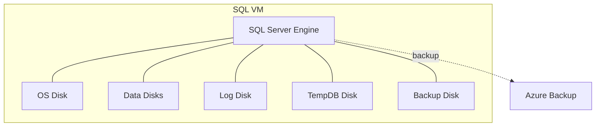
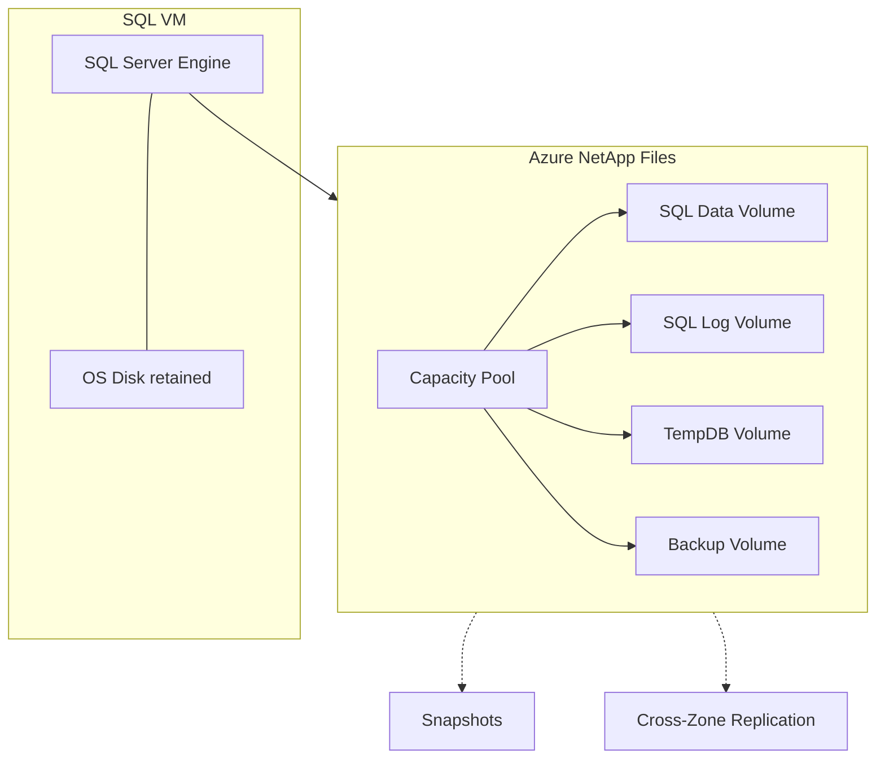
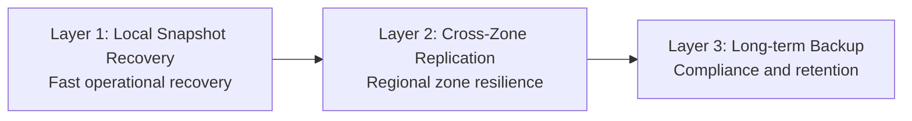

# ANF Architecture Discussion: SQLPRD01
**Customer-Facing View: Azure NetApp Files for SQL Server on Azure VM**

Prepared: May 28, 2026
Reference workload: SQLPRD01 (Production)
Scope: Business value, high-level design, and option comparison

---

## 1. Executive Summary

The current SQL Server platform is functional, but constrained by per-disk limits, lower availability targets, and fragmented storage management. Moving SQL data, log, tempdb, and backup paths to Azure NetApp Files (ANF) introduces a more elastic storage model with stronger resiliency and simpler lifecycle management.

### Business outcomes

| Outcome | Current State | Target with ANF |
|---|---|---|
| Availability objective | 99.0% storage SLA | 99.99% ANF volume SLA |
| Backup growth risk | Backup path nearing capacity | Thin-provisioned volumes with easier expansion |
| Recovery posture | VM-centric restore motion | Snapshot and replication-based data recovery options |
| Storage agility | Disk-by-disk changes | Centralized pool and volume policy model |
| Test and refresh speed | Full-copy workflows | Snapshot-based clone workflows |

---

## 2. High-Level Architecture

### 2.1 Current model: VM with attached disks

### 2.2 Target model: SQL VM + Azure NetApp Files

### 2.3 Why this design is different

| Design characteristic | Attached Disk Model | ANF Model |
|---|---|---|
| Scaling approach | Add/resize individual disks | Adjust storage volumes and pool policy |
| Data services | Backup-led point recovery | Native snapshots, replication, and cloning |
| Management boundary | Multiple disk objects | Shared storage platform for SQL data services |
| Flexibility | Capacity and performance changes are coupled | Capacity and performance planning can be separated at design level |

---

## 3. Option Comparison

### 3.1 Strategic comparison

| Dimension | Stay on Azure Disks | Move to ANF |
|---|---|---|
| Availability target | Lower storage availability objective | Higher storage availability objective |
| Capacity growth handling | Incremental disk management overhead | Centralized volume growth model |
| DR readiness | Recovery mainly through backup restore | Snapshot + replication based recovery tiers |
| Clone/test workflows | Slower full-copy patterns | Fast snapshot-clone patterns |
| Operational simplicity | More platform touch points | Fewer, policy-driven storage touch points |
| Cost predictability | Simpler baseline, less agility | Better agility; requires governance for pool usage |

### 3.2 Trade-offs to acknowledge

| Consideration | Impact |
|---|---|
| Network-based file storage model | Requires strong network and identity hygiene |
| New operating model | Teams adopt ANF-centric lifecycle and governance |
| Service adoption curve | Upfront architecture alignment needed across DBA, Infra, and Ops |

---

## 4. Resiliency and DR Positioning

### 4.1 Recovery layers

### 4.2 Recovery posture comparison

| Scenario | Current Posture | ANF-Enabled Posture |
|---|---|---|
| Short RTO operational restore | Dependent on backup workflow | Snapshot-led restore options |
| Zone disruption | Limited active standby mechanics | Cross-zone replicated volume strategy |
| Long-term retention | Backup-vault centric | Backup-vault plus ANF-aligned data protection options |

---

## 5. Migration Approach (Executive View)

Migration is designed as a phased business change, not a single technical event.

| Phase | Intent | Customer-facing result |
|---|---|---|
| Phase 1: Foundation | Prepare target architecture and guardrails | Low-risk readiness and clear rollback posture |
| Phase 2: Pilot | Validate on non-production equivalent workload | Proven design before production exposure |
| Phase 3: Production cutover | Move priority workload in planned window | Controlled transition with minimal disruption |
| Phase 4: Stabilize and optimize | Monitor, tune, and standardize | Repeatable operating model for future workloads |

---

## 6. Recommendation

Proceed with ANF for SQLPRD01 as the preferred architecture direction, with a phased rollout and clear success gates.

### Recommended decision points

| Decision | Rationale |
|---|---|
| Adopt ANF as target state for SQL storage services | Better alignment to availability, agility, and recoverability goals |
| Start with a pilot workload pattern | Reduces change risk and builds implementation confidence |
| Standardize on tiered resiliency design | Balances operational recovery, zone resilience, and retention requirements |
| Track value realization after cutover | Measures outcome against SLA, recovery, and operational simplicity targets |

---

## 7. Customer Discussion Prompts

1. Which business service requires the strongest RTO/RPO objective first?
2. Is the immediate priority backup-risk reduction, DR improvement, or both?
3. What is the target timeline for production adoption after pilot sign-off?
4. Which governance model should own ANF capacity and resiliency policy decisions?
