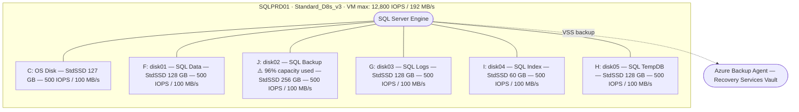
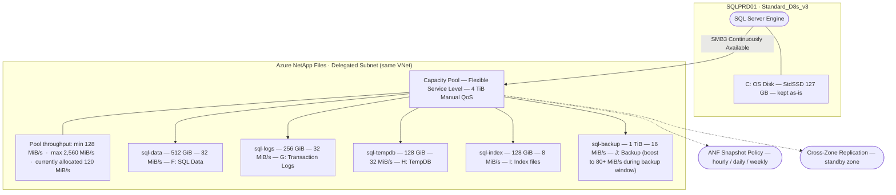
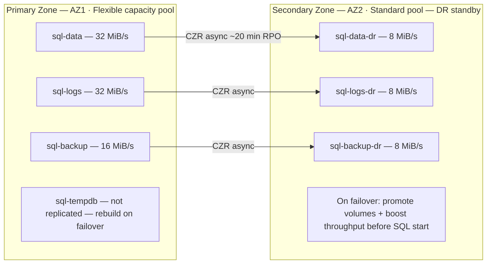
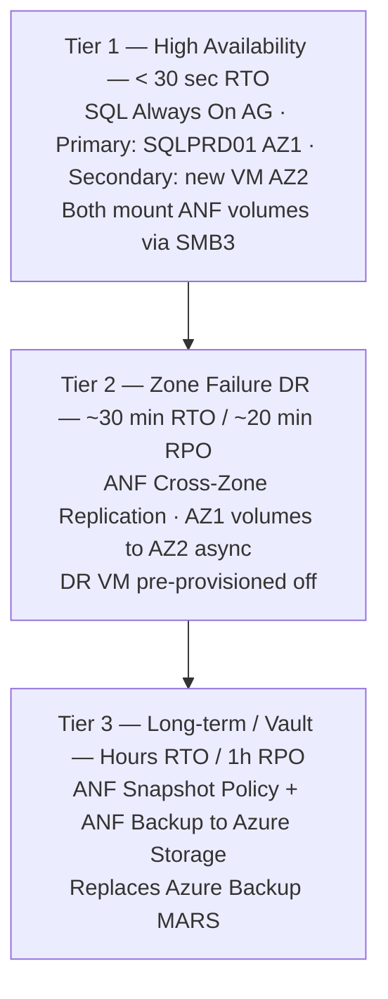

# ANF Migration & Evaluation: SQLPRD01
**Azure NetApp Files — SQL Server on Azure VM Technical Assessment**

Prepared: May 16, 2026  
Reference VM: SQLPRD01 (Production, Contoso-CA-Production)  
Scope: Architecture · Migration · Disaster Recovery · Operations · Technical Validation

---

## Table of Contents

1. [Executive Summary](#1-executive-summary)
2. [Architecture Comparison](#2-architecture-comparison)
3. [Migration Plan: Disk to ANF](#3-migration-plan-disk-to-anf)
4. [Disaster Recovery](#4-disaster-recovery)
5. [Daily Operations & Troubleshooting](#5-daily-operations--troubleshooting)
6. [Technical Validation Test Plan](#6-technical-validation-test-plan)
- [Appendix A: Cost Comparison Estimate](#appendix-a-cost-comparison-estimate)
- [Appendix B: Key Reference Links](#appendix-b-key-reference-links)
- [Appendix C: Test VM Provisioning Scripts](#appendix-c-test-vm-provisioning-scripts)

---

## 1. Executive Summary

### Current State

SQLPRD01 runs SQL Server on a Standard_D8s_v3 VM with five Standard SSD (StandardSSD_LRS) data disks totaling ~700 GB. Key findings from the 90-day discovery:

| Concern | Detail |
|---|---|
| **Backup drive crisis** | J: (256 GB) peaks at 96% used, minimum 10 GB free — backup failures imminent |
| **Memory pressure** | 94% peak utilization on 32 GiB — SQL buffer pool under pressure |
| **Storage SLA** | 99.0% only (Standard SSD) — ~87.6 hr/year allowable downtime |
| **Throughput ceiling** | Each StandardSSD disk capped at 500 IOPS / 100 MB/s regardless of VM capacity (12,800 IOPS / 192 MB/s available) |
| **No native data management** | Snapshots, replication, and clone require third-party or Azure Backup agents |

### Migration Drivers for ANF

| Driver | ANF Benefit |
|---|---|
| Backup drive at capacity | ANF volumes are thin-provisioned; capacity pool can be extended without disk resize or downtime |
| Per-disk IOPS ceiling | ANF Manual QoS pool assigns throughput per volume independently — no tier lock-in, rebalance anytime without resizing |
| DR complexity | ANF cross-zone replication (CZR) + snapshots replace multi-disk Azure Backup coordination |
| Data management | Space-efficient snapshots, instant clones for test environments |
| SLA improvement | ANF delivers 99.99% availability SLA on volumes |

---

## 2. Architecture Comparison

### 2.1 Current Architecture: Direct-Attached Azure Disk



**Key constraints of the current design:**

- **IOPS is disk-count-bound.** Each StandardSSD disk provides up to 500 IOPS regardless of VM capacity. Five disks → max 2,500 IOPS total, while the VM supports 12,800 IOPS. The storage is the bottleneck, not the compute.
- **Throughput is disk-count-bound.** 5 × 100 MB/s = 500 MB/s theoretical, but VM NIC allows only 192 MB/s for data disks on D8s_v3 — the VM cap is the real ceiling.
- **Disks are independently managed.** Resizing J: from 256 GB to 512 GB requires a disk resize operation (offline for StandardSSD or hot-resize with OS support), followed by partition extension inside the OS.
- **Crash-consistent snapshots require coordination.** Azure Backup uses VSS to quiesce SQL, but all five disks must be snapshotted in sequence, creating a multi-disk orchestration dependency.
- **Capacity is pre-provisioned.** You pay for 256 GB on J: even when only 50 GB is used. There is no thin provisioning.

### 2.2 Target Architecture: Azure NetApp Files (SMB3)



**Key capabilities of the ANF design:**

- **SMB3 with continuously available (CA) shares** — SQL Server files are stored on ANF volumes mounted as UNC shares. SQL Server supports this natively (since SQL Server 2012 with ANF SMB3 CA).
- **Flexible service level — throughput is decoupled from volume size.** With a Flexible service level capacity pool (Manual QoS), each volume receives an explicit MiB/s allocation regardless of its quota. sql-logs can be assigned 32 MiB/s on a 256 GiB quota; sql-backup can be assigned 16 MiB/s on a 1 TiB quota. Throughput is rebalanced online at any time by updating the volume's `--throughput-mibps` — no quota change, no VM restart, no service disruption. See [ANF Flexible service level](https://learn.microsoft.com/en-us/azure/azure-netapp-files/azure-netapp-files-service-levels#flexible-examples).
- **Single pool, no tier proliferation.** One Flexible capacity pool replaces the need for separate Standard, Premium, and Ultra pools. A 4 TiB Flexible pool guarantees a minimum of 128 MiB/s and supports a maximum of 2,560 MiB/s (5 × 128 MiB/s × 4 TiB) — far exceeding the D8s_v3 VM NIC cap of 192 MB/s. This eliminates the operational overhead of managing multiple pools at different service levels.
- **Thin provisioning.** The sql-backup volume shows 1 TiB quota but ANF only charges for consumed data. Resolve the J: backup capacity crisis without pre-paying for 1 TiB.
- **Snapshot policy is application-consistent for SQL.** ANF snapshots are volume-level and near-instantaneous (metadata operation). Combined with SQL VSS writer or SQL frozen I/O, they are application-consistent.
- **IOPS scales with throughput.** A volume assigned 32 MiB/s with 8 KiB random I/O can sustain ~4,000 IOPS. Increase `--throughput-mibps` to instantly raise the IOPS ceiling without any disk reconfiguration.

### 2.3 Architecture Differences Summary

| Dimension | Direct-Attached Disk | Azure NetApp Files |
|---|---|---|
| **Protocol** | Block (page blob via VHD) | File (SMB3 on Windows) |
| **IOPS scaling** | Add more disks (striping) | Increase `--throughput-mibps` on the volume (Manual QoS) — instant, no downtime |
| **Throughput scaling** | Add more disks | Increase manual throughput allocation; rebalance from idle volumes in the same pool |
| **Capacity model** | Pre-provisioned, pay full size | Thin-provisioned within quota |
| **Snapshot** | Azure Backup coordinated (VSS agent) | ANF native, near-instant, per-volume |
| **Clone for test/dev** | Full disk copy (slow, costs full GiB) | ANF volume clone from snapshot (instant) |
| **Cross-region/zone DR** | Azure Site Recovery or Backup restore | ANF Cross-Zone Replication (CZR) built-in |
| **Resize** | Disk resize + OS partition extend | Change volume quota, no downtime |
| **SLA** | 99.0% (Standard SSD) | 99.99% |
| **Max downtime/year** | ~87.6 hours | ~52 minutes |
| **Management plane** | Azure Disk Manager (per disk) | Single ANF Account, one Flexible capacity pool — all throughput managed in one place |
| **Multi-VM sharing** | Not supported (block) | Supported (same SMB3 share) — useful for AG |
| **Latency profile** | Sub-millisecond (local NVMe path) | ~1 ms average (network SMB, same AZ) |

### 2.4 Performance Sizing: Current vs ANF Target for SQLPRD01

**Observed peak workloads (90-day):**

| Volume Role | Current Disk | Observed Avg IOPS | Observed Max IOPS | Observed Max MB/s |
|---|---|---:|---:|---:|
| SQL Data (F:) | disk01, 128 GB Std SSD | 0.28 | 45.58 | 9.14 |
| SQL Backup (J:) | disk02, 256 GB Std SSD | 1.70 | 38.11 | 36.34 |
| SQL Logs (G:) | disk03, 128 GB Std SSD | 0.31 | 63.68 | 6.84 |
| SQL Misc (H:) | disk05, 128 GB Std SSD | 3.00 | 306.44 | 18.16 |
| SQL Index (I:) | disk04, 60 GB Std SSD | ~0.00 | 0.04 | 0.01 |

**ANF volume sizing recommendation — Flexible service level pool:**

| ANF Volume | Quota | Manual Throughput | Headroom vs Observed Peak | Notes |
|---|---:|---:|---|---|
| sql-data | 512 GiB | 32 MiB/s | 3.5× above 9.14 MB/s peak | Increase to 64 MiB/s if OLAP queries grow |
| sql-logs | 256 GiB | 32 MiB/s | 4.7× above 6.84 MB/s peak | Latency-sensitive; keep throughput headroom |
| sql-tempdb | 128 GiB | 32 MiB/s | Burst-ready for sort/hash spills | Can borrow from large Flexible pool budget |
| sql-index | 128 GiB | 8 MiB/s | Near-idle; right-sized | Increase transiently during index rebuild |
| sql-backup | 1,024 GiB | 16 MiB/s | Resolves 96% capacity crisis | Boost to 150 MiB/s during backup window (VM NIC is the cap) |
| **Pool total** | **4 TiB** | **120 MiB/s assigned** | Max budget: 2,560 MiB/s · VM NIC cap: 192 MB/s | |

**Flexible service level throughput management:** The Flexible service level (Manual QoS) provides a minimum guaranteed throughput of 128 MiB/s for the pool and a maximum of `5 × 128 MiB/s × pool_TiB`. For a 4 TiB pool, the max is **2,560 MiB/s** — far exceeding the D8s_v3 VM NIC cap of 192 MB/s. The VM NIC, not the pool, is the practical per-VM ceiling. Example: boost sql-backup to 150 MiB/s during nightly backup window (02:00–05:00), then return to 16 MiB/s for the day — no pool resize, no volume resize, no SQL restart. When the 4 TiB pool is shared across multiple VMs, each VM can simultaneously receive up to its NIC cap, so the large pool budget supports all four production VMs at full speed. Automate with Azure Automation or a scheduled script calling `az netappfiles volume update --throughput-mibps`.

**Note:** All volumes reside in a single 4 TiB Flexible capacity pool. The backup volume quota of 1 TiB is thin-provisioned — billing is based on consumed GiB only. Remaining pool capacity is shared with other production VMs (SQLPRD02, SQLPRD03, SQLPRD04).

---

## 3. Migration Plan: Disk to ANF

### 3.1 Pre-Migration Assessment (Week 1)

#### Step 1: Validate ANF prerequisites

| Check | Action |
|---|---|
| ANF delegated subnet | Create or verify a `/28` subnet in the same VNet as SQLPRD01, delegated to `Microsoft.NetApp/volumes` |
| Active Directory integration | ANF SMB3 requires AD join for Kerberos/NTLM auth — register ANF account with the same AD domain as SQLPRD01 |
| SMB CA file share support | Verify SQL Server version ≥ 2012 with latest CU; confirm OS is Windows Server 2016+ |
| Network latency baseline | Run `ping` and `psping` from SQLPRD01 to ANF endpoint; target < 2 ms |
| SQL Server data/log file locations | Run `SELECT name, physical_name FROM sys.master_files` to map all databases to current drive letters |

#### Step 2: Baseline current performance (use as comparison baseline for test plan)

```sql
-- Capture wait stats baseline
SELECT wait_type, waiting_tasks_count, wait_time_ms, signal_wait_time_ms
FROM sys.dm_os_wait_stats
WHERE wait_type IN ('PAGEIOLATCH_SH','PAGEIOLATCH_EX','WRITELOG','IO_COMPLETION','BACKUPIO')
ORDER BY wait_time_ms DESC;

-- Capture I/O stall baseline
SELECT DB_NAME(vfs.database_id) AS DatabaseName,
       mf.physical_name,
       vfs.io_stall_read_ms,
       vfs.io_stall_write_ms,
       vfs.num_of_reads,
       vfs.num_of_writes
FROM sys.dm_io_virtual_file_stats(NULL, NULL) vfs
JOIN sys.master_files mf ON vfs.database_id = mf.database_id AND vfs.file_id = mf.file_id;
```

Save output to `baseline_io_prestats_YYYYMMDD.txt`.

#### Step 3: Disk-to-volume role mapping

Based on drive letter analysis and ANF target design:

| Current Drive | Size | Used (Peak) | Mapped ANF Volume | Manual Throughput |
|---|---|---|---|---|
| F: (disk01) | 128 GB | ~68 GB | sql-data | 32 MiB/s |
| J: (disk02) | 256 GB | 245 GB peak | sql-backup | 16 MiB/s (boost to 80 MiB/s during backup) |
| G: (disk03) | 128 GB | ~33 GB | sql-logs | 32 MiB/s |
| H: (disk05) | 128 GB | ~5.5 GB | sql-tempdb | 32 MiB/s |
| I: (disk04) | 60 GB | ~0.14 GB | sql-index | 8 MiB/s |

### 3.2 ANF Infrastructure Setup (Week 1–2)

```bash
# Azure CLI — Create ANF account
az netappfiles account create \
  --resource-group Contoso-CA-PRD-ANF-RG \
  --location canadacentral \
  --name anfacct-contoso

# Create capacity pool — Flexible service level, Manual QoS (single pool for all SQL volumes)
az netappfiles pool create \
  --resource-group Contoso-CA-PRD-ANF-RG \
  --location canadacentral \
  --account-name anfacct-contoso \
  --pool-name sql-pool-prd \
  --size 4 \
  --service-level Flexible \
  --qos-type Manual
# Pool budget: 4 TiB Flexible — min 128 MiB/s guaranteed, max 5 × 128 × 4 = 2,560 MiB/s
# In practice the D8s_v3 VM NIC (192 MB/s) is the per-VM throughput ceiling

# Create SMB volumes — set --throughput-mibps per volume (service-level inherited from pool)
# sql-data: SQL data files, 32 MiB/s
az netappfiles volume create \
  --resource-group Contoso-CA-PRD-ANF-RG \
  --location canadacentral \
  --account-name anfacct-contoso \
  --pool-name sql-pool-prd \
  --name sql-data \
  --usage-threshold 512 \
  --throughput-mibps 32 \
  --protocol-types CIFS \
  --subnet-id /subscriptions/<sub-id>/resourceGroups/Contoso-CA-PRD-ANF-RG/providers/Microsoft.Network/virtualNetworks/<vnet>/subnets/anf-delegated

# sql-logs: Transaction logs, 32 MiB/s (latency-sensitive)
az netappfiles volume create ... --name sql-logs --usage-threshold 256 --throughput-mibps 32

# sql-tempdb: TempDB, 32 MiB/s (can boost further from large Flexible pool budget)
az netappfiles volume create ... --name sql-tempdb --usage-threshold 128 --throughput-mibps 32

# sql-index: Index/misc, 8 MiB/s (near-idle; expandable for index rebuilds)
az netappfiles volume create ... --name sql-index --usage-threshold 128 --throughput-mibps 8

# sql-backup: Backup files, 16 MiB/s default (boost to 150 MiB/s during backup window — VM NIC limited)
az netappfiles volume create ... --name sql-backup --usage-threshold 1024 --throughput-mibps 16

# Total allocated: 120 MiB/s of 2,560 MiB/s Flexible pool max budget
```

**AD connector registration (required before SMB volume creation):**

```bash
az netappfiles account ad add \
  --resource-group Contoso-CA-PRD-ANF-RG \
  --account-name anfacct-contoso \
  --username <svc-account> \
  --password <password> \
  --domain <domain.local> \
  --dns <DC-IP> \
  --smb-server-name ANFSMB01
```

### 3.3 Migration Execution (Week 2–3)

Migration approach: **Online data copy with SQL offline cutover window.** This minimizes downtime to the final move of transaction logs and SQL data files.

#### Phase A: Copy bulk data (with SQL running)

Use `robocopy` to pre-stage data to ANF while SQL continues serving traffic:

```powershell
# Pre-stage SQL data files (databases in READ_WRITE, SQL still running)
# Note: cannot copy open .mdf/.ldf directly. Use backup/restore approach.

# Step 1: Take full backup of all databases to ANF sql-backup volume
$databases = Invoke-Sqlcmd -Query "SELECT name FROM sys.databases WHERE state = 0 AND name NOT IN ('tempdb')" -ServerInstance "SQLPRD01"
foreach ($db in $databases) {
    $backupPath = "\\ANFSMB01\sql-backup\migration\$($db.name)_FULL_$(Get-Date -Format yyyyMMdd).bak"
    Invoke-Sqlcmd -Query "BACKUP DATABASE [$($db.name)] TO DISK = '$backupPath' WITH COMPRESSION, STATS = 10" -ServerInstance "SQLPRD01"
}
```

#### Phase B: Cutover window (planned maintenance)

Estimated downtime: **30–60 minutes** (depending on log catch-up size)

```sql
-- Step 1: Set all user databases to SINGLE_USER to quiesce
-- (Schedule maintenance window, notify users)

-- Step 2: Final transaction log backup to ANF
BACKUP LOG [DatabaseName]
TO DISK = '\\ANFSMB01\sql-backup\migration\DatabaseName_LOG_final.trn'
WITH NORECOVERY;

-- Step 3: Restore databases to ANF volumes with MOVE
RESTORE DATABASE [DatabaseName]
FROM DISK = '\\ANFSMB01\sql-backup\migration\DatabaseName_FULL_YYYYMMDD.bak'
WITH NORECOVERY,
     MOVE 'DatabaseName_data' TO '\\ANFSMB01\sql-data\DatabaseName.mdf',
     MOVE 'DatabaseName_log'  TO '\\ANFSMB01\sql-logs\DatabaseName_log.ldf';

-- Step 4: Apply log backup
RESTORE LOG [DatabaseName]
FROM DISK = '\\ANFSMB01\sql-backup\migration\DatabaseName_LOG_final.trn'
WITH RECOVERY;

-- Step 5: Verify
SELECT name, state_desc, physical_name FROM sys.master_files WHERE database_id = DB_ID('DatabaseName');
```

#### Phase C: Move system/config files

- **TempDB:** Update `tempdb` file locations in SQL Server Configuration Manager or via `ALTER DATABASE tempdb MODIFY FILE`, then restart SQL Server service. New path: `\\ANFSMB01\sql-tempdb\`.
- **SQL Server Error Log and Agent:** Update paths in SQL Server Properties → Advanced.
- **SQL Server Startup parameters:** Update `-eErrorLog` path if redirected.

#### Phase D: Decommission old disks

After 7-day validation period (SQL running on ANF, all tests passed):

1. Remove old data disks from VM (Portal → VM → Disks → Detach)
2. Snapshot old disks before deletion as final safety copy
3. Delete old disks to stop billing

### 3.4 Rollback Plan

| Rollback Trigger | Action |
|---|---|
| SMB mount failures post-cutover | Remount SQL file paths to original drive letters; restart SQL Server |
| Performance degradation > 20% vs baseline | Revert SQL file paths to original disks (still attached during 7-day validation) |
| Data integrity failure | Restore from last good Azure Backup on original disks |

**Key safety rule:** Do NOT detach original disks for at least 7 days after cutover. Keep them attached (not mounted in OS) as instant rollback option.

---

## 4. Disaster Recovery

### 4.1 Current DR State

SQLPRD01 currently relies on:

| Component | Current Implementation | Limitation |
|---|---|---|
| **Backup** | Azure Backup (MARS or VM-level snapshot) | Multi-disk consistency requires VSS coordination; J: at 96% may cause backup failures |
| **RPO** | Typically 24h (daily backup policy) | Point-in-time restore is limited to recovery point frequency |
| **RTO** | Full VM restore from Recovery Services Vault → hours | Must restore entire VM + all disks, then bring SQL online |
| **HA** | Single VM, no Always On AG detected | 99.0% SLA; no automatic failover |
| **GEO/Zone DR** | Not confirmed — dependent on Backup vault geo-redundancy | Vault replication passive; no active standby |

### 4.2 ANF DR Capabilities

#### 4.2.1 ANF Snapshots

ANF snapshots are **space-efficient, near-instantaneous volume-level operations** taken at the storage layer, independent of the VM or SQL Server agent.

| Property | Detail |
|---|---|
| **Frequency** | Configurable per volume: up to hourly, daily, weekly, monthly |
| **Retention** | Per policy tier: e.g., keep 24 hourly, 7 daily, 4 weekly |
| **Storage cost** | Charged only for changed blocks since last snapshot (delta) |
| **Restore** | Single-file restore or full volume revert (online, no VM restart) |
| **Application consistency** | Use SQL VSS writer or `BACKUP DATABASE ... SNAPSHOT` before triggering ANF snapshot for crash-consistent guarantee |

Recommended snapshot policy for sql-data and sql-logs:

```
Hourly:  retain 24 snapshots  (every hour, ~1 hour RPO)
Daily:   retain 7 snapshots   (daily, off-peak)
Weekly:  retain 4 snapshots   (Sunday 02:00)
Monthly: retain 3 snapshots   (1st of month)
```

#### 4.2.2 ANF Cross-Zone Replication (CZR)

CZR replicates ANF volumes asynchronously to a volume in a different Availability Zone within the same region (e.g., Canada Central AZ1 → AZ2).



**DR pool design:** The DR pool uses Standard Auto QoS (lower cost acceptable for standby). On failover, the DR volumes are promoted and throughput can be raised to match primary Flexible pool levels via `az netappfiles volume update --throughput-mibps` before bringing SQL online.

| Property | Detail |
|---|---|
| **RPO** | ~20 minutes (async replication interval) |
| **RTO** | Break replication → mount volumes on DR VM → start SQL → ~15–30 minutes |
| **Failover** | Manual (`az netappfiles volume replication approve-external-replication`) or triggered by Azure Monitor alert |
| **Cost** | Pay for destination volume (Standard tier acceptable for DR) + data transfer |

#### 4.2.3 ANF Backup

ANF Backup is a managed long-term backup that stores data in Azure storage independent of the ANF capacity pool — protecting against accidental volume deletion.

| Property | Detail |
|---|---|
| **Policy** | Configurable: daily, weekly, monthly retention |
| **Storage** | Stored in Azure storage (not ANF pool) — no pool capacity consumed |
| **Use case** | Long-term retention (30/60/180 days) replacing or complementing Azure Backup vault |
| **Restore** | Restore to a new ANF volume; remount and attach to SQL |
| **RTO for long-term restore** | ~1–2 hours (depends on volume size and network) |

### 4.3 Recommended DR Design: ANF + SQL HA

#### Tiered DR architecture



**Phased approach for Contoso:** Start with Tier 3 (snapshots + ANF backup) to immediately resolve backup capacity crisis, then add Tier 2 (CZR) for zone DR, then evaluate Tier 1 (AG) based on RTO requirements.

### 4.4 DR Comparison Matrix

| Capability | Azure Backup (current) | ANF Snapshots | ANF CZR | ANF Backup |
|---|---|---|---|---|
| RPO | 24 hours (daily) | 1 hour | ~20 minutes | 24 hours |
| RTO | 4–8 hours (full VM restore) | Minutes (file/vol revert) | 15–30 minutes | 1–2 hours |
| Backup drive capacity | Limited by J: disk size | Not applicable | Not applicable | Stored outside pool |
| Application consistency | VSS (agent-based) | VSS + ANF snapshot | Async (log-based) | Same as snapshot |
| Test/clone for DR drill | Full VM copy required | Instant ANF clone | Restore from DR volume | Restore to new volume |
| Cross-zone protection | Vault GRS (passive) | Same zone only | Active async replication | Vault GRS |
| SLA | Backup vault 99.9% | ANF 99.99% | ANF 99.99% | Azure Storage 99.999% |
| Cost model | Per VM per month | Snapshot delta storage | Destination volume + transfer | Per GiB per month |
| Operational complexity | Medium (agent + policy) | Low (portal/CLI policy) | Medium (peering + failover) | Low |

---

## 5. Daily Operations & Troubleshooting

### 5.1 Storage Administration Changes

| Task | With Azure Disk | With ANF |
|---|---|---|
| **Expand backup volume** | Detach disk → resize in portal → expand partition in OS | Change ANF volume quota in portal/CLI — no OS steps |
| **Create test DB copy** | Clone disk (full GiB copy, slow) | Create ANF volume clone from snapshot — instant, space-efficient |
| **Add capacity** | Attach new disk, format, mount, update SQL paths | Increase capacity pool size or add to existing pool |
| **View storage metrics** | Azure Monitor Disk metrics (IOPS, MB/s) | ANF volume metrics (throughput, consumed size, snapshot size) |
| **Snapshot management** | Azure Backup dashboard | ANF → Volumes → Snapshots (per-volume list) |
| **Reduce throughput cost** | Detach + copy to cheaper disk SKU (hours) | Lower `--throughput-mibps` on the volume (online, seconds) |
| **Rebalance for peak events** | Not possible without adding disks | Shift MiB/s from idle volumes (e.g., sql-index) to active ones (e.g., sql-backup during backup window) — online, no SQL restart |

#### Volume quota expansion (no downtime):

```bash
# Expand sql-backup from 1 TiB to 2 TiB
az netappfiles volume update \
  --resource-group Contoso-CA-PRD-ANF-RG \
  --account-name anfacct-contoso \
  --pool-name sql-pool-prd \
  --name sql-backup \
  --usage-threshold 2048
# The volume appears larger to the OS immediately — no restart, no repartition needed
```

#### Dynamic throughput rebalancing (Flexible service level — no downtime, no quota change):

```bash
# Boost sql-backup throughput before nightly backup window (e.g., 02:00)
# Flexible pool max is 2,560 MiB/s; VM NIC cap on D8s_v3 is ~192 MB/s in practice
az netappfiles volume update \
  --resource-group Contoso-CA-PRD-ANF-RG \
  --account-name anfacct-contoso \
  --pool-name sql-pool-prd \
  --name sql-backup \
  --throughput-mibps 150

# Restore to baseline after backup completes (e.g., 05:00)
az netappfiles volume update ... --name sql-backup --throughput-mibps 16

# Temporarily boost sql-index during weekend index rebuild
az netappfiles volume update ... --name sql-index --throughput-mibps 128
# Restore after rebuild
az netappfiles volume update ... --name sql-index --throughput-mibps 8

# Check current throughput assignments across all volumes in the pool
az netappfiles volume list \
  --resource-group Contoso-CA-PRD-ANF-RG \
  --account-name anfacct-contoso \
  --pool-name sql-pool-prd \
  --query "[].{Name:name, ThroughputMibps:throughputMibps, QuotaGiB:usageThreshold}" -o table
```

> **Rule:** The sum of all volume `--throughput-mibps` values must not exceed the pool max budget. For the Flexible service level: `5 × 128 MiB/s × pool_TiB`. A 4 TiB Flexible pool supports up to **2,560 MiB/s** total (minimum guaranteed: 128 MiB/s regardless of pool size). The CLI will reject an assignment that would exceed the pool budget. In practice, the D8s_v3 VM NIC cap (~192 MB/s) is the lower per-VM limit — the pool budget is rarely the constraint when sharing across multiple VMs.

#### On-demand snapshot before maintenance:

```bash
az netappfiles snapshot create \
  --resource-group Contoso-CA-PRD-ANF-RG \
  --account-name anfacct-contoso \
  --pool-name sql-pool-prd \
  --volume-name sql-data \
  --name pre-patching-$(date +%Y%m%d%H%M)
```

### 5.2 Performance Monitoring

#### Key ANF metrics to monitor (Azure Monitor)

| Metric | Alert Threshold | Meaning |
|---|---|---|
| `VolumeConsumedSizePercentage` | > 80% | Volume filling — expand quota before hitting limit |
| `VolumeThroughput` | > 85% of provisioned | Approaching tier throughput ceiling |
| `VolumeReadThroughput` + `VolumeWriteThroughput` | Baseline × 2 | Unusual I/O spike |
| `VolumeSnapshotSize` | > 20% of volume | Snapshot churn high — review retention policy |
| `AverageReadLatency` | > 5 ms | Network or ANF latency issue |
| `AverageWriteLatency` | > 2 ms | Log volume latency — check sql-logs throughput allocation (increase `--throughput-mibps`) |

#### SQL Server wait stats on ANF (post-migration reference)

After migration, watch these waits to confirm ANF is not a bottleneck:

```sql
-- Run weekly and compare to pre-migration baseline
SELECT TOP 10
    wait_type,
    waiting_tasks_count,
    wait_time_ms / 1000.0 AS wait_time_sec,
    ROUND(100.0 * wait_time_ms / SUM(wait_time_ms) OVER(), 2) AS pct_total
FROM sys.dm_os_wait_stats
WHERE wait_type NOT IN (
    'SLEEP_TASK','BROKER_TO_FLUSH','BROKER_TASK_STOP','CLR_AUTO_EVENT',
    'REQUEST_FOR_DEADLOCK_MONITOR','RESOURCE_QUEUE','SERVER_IDLE_CHECK',
    'SLEEP_DBSTARTUP','SLEEP_DCOMSTARTUP','SLEEP_MASTERDBREADY',
    'SLEEP_MASTERMDREADY','SLEEP_MASTERUPGRADED','SLEEP_MSDBSTARTUP',
    'SLEEP_TEMPDBSTARTUP','SNI_HTTP_ACCEPT','SP_SERVER_DIAGNOSTICS_SLEEP',
    'SQLTRACE_BUFFER_FLUSH','WAITFOR','XE_DISPATCHER_WAIT','XE_TIMER_EVENT'
)
ORDER BY wait_time_ms DESC;
```

**Expected change post-migration:**
- `PAGEIOLATCH_SH` / `PAGEIOLATCH_EX` — should decrease (ANF lower latency for sequential reads vs Standard SSD)
- `WRITELOG` — should decrease (32 MiB/s dedicated throughput on sql-logs via Flexible service level)
- `BACKUPIO` — should decrease (higher throughput to sql-backup volume)

### 5.3 Capacity Management

#### Current problem: J: backup drive at 96% peak

With ANF, the sql-backup volume at 1 TiB quota means the backup process has 4× the current headroom. The consumed space is visible directly in ANF metrics. Set an alert at 80% consumed (`VolumeConsumedSizePercentage > 80`) to trigger capacity review before any crisis.

#### Snapshot space tracking

Snapshots consume delta space in the capacity pool (not the volume quota). Monitor the `VolumeSnapshotSize` metric per volume. If snapshot accumulation is large:

```bash
# List snapshot sizes for sql-data
az netappfiles snapshot list \
  --resource-group Contoso-CA-PRD-ANF-RG \
  --account-name anfacct-contoso \
  --pool-name sql-pool-prd \
  --volume-name sql-data \
  --query "[].{Name:name, Created:created}" -o table
```

### 5.4 Troubleshooting Runbook

#### Scenario 1: SMB share not accessible from SQL Server

```
Symptom: SQL Server service fails to start / databases in RECOVERY_PENDING
Check:
1. Test UNC path: Test-Path \\ANFSMB01\sql-data
2. Check ANF subnet delegation: Portal → VNet → Subnets → anf-delegated
3. Verify AD computer object for ANFSMB01 in AD
4. Check SMB signing: Get-SmbClientConfiguration | Select RequireSecuritySignature
5. Review ANF portal → Volume → Status should show "Available"
Resolution:
- If AD auth failure: rejoin ANF to domain via Portal → ANF Account → Active Directory
- If network: check NSG on anf-delegated subnet (no NSG should be applied to delegated subnet)
```

#### Scenario 2: High latency on sql-logs volume

```
Symptom: WRITELOG waits elevated in SQL wait stats; log write latency > 2 ms
Check:
1. Portal → ANF → sql-logs → Metrics → AverageWriteLatency
2. Check VolumeThroughput vs assigned (sql-logs currently set to 32 MiB/s)
   az netappfiles volume show ... --name sql-logs --query throughputMibps
3. Confirm volume is in the same AZ as the VM (cross-AZ adds latency)
Resolution:
- If throughput cap hit: increase sql-logs throughput from the Flexible pool budget
  az netappfiles volume update ... --name sql-logs --throughput-mibps 64
  (Flexible pool max for 4 TiB = 2,560 MiB/s; sum of all volume assignments must stay within that limit)
- If latency structural (> 3 ms consistently): verify ANF delegated subnet is in same AZ as VM
```

#### Scenario 3: Backup job failing or slow

```
Symptom: SQL Agent backup job times out; sql-backup at high consumed %
Check:
1. Portal → ANF → sql-backup → Metrics → VolumeConsumedSizePercentage
2. Check backup file count: dir \\ANFSMB01\sql-backup
3. Verify ANF snapshot policy isn't also consuming pool space unexpectedly
Resolution:
- Immediate: expand sql-backup quota (az netappfiles volume update --usage-threshold 2048)
- Long-term: implement backup file retention cleanup job
- Enable ANF Backup for sql-backup volume to offload old backups to vault storage
```

#### Scenario 4: Volume consumed percentage suddenly increases

```
Symptom: Alert fires — VolumeConsumedSizePercentage > 80% for sql-data
Check:
1. List snapshots and their ages — old snapshots hold delta data
2. Check for large transaction log VLF growth
3. Verify no unauthorized file copies placed on share
Resolution:
- Delete expired snapshots: az netappfiles snapshot delete ...
- Expand volume quota if legitimate data growth: --usage-threshold +256
```

---

## 6. Technical Validation Test Plan

### 6.1 Test Objectives

**Test priority rationale:** SQLPRD01's observed peak throughput tops out at 36 MB/s (backup) and 18 MB/s (TempDB) — well below the 100 MB/s per-disk StandardSSD cap and the 192 MB/s VM NIC ceiling. ANF volumes provisioned at 32 MiB/s each already cover the real workload. A raw throughput benchmark against ANF will not surface meaningful differentiation from current disks at these I/O levels. The primary test value lies in **migration procedure validation, operational manageability, snapshot/restore correctness, and CZR failover reliability** — these are the areas where ANF changes the operational model substantially.

| # | Priority | Objective | Success Criterion |
|---|---|---|---|
| T1 | **High** | Confirm SQL Server connects and operates on ANF SMB3 volumes | All databases ONLINE; no errors in SQL error log |
| T2 | Low | Latency regression check — confirm ANF does not degrade SQL wait stats vs disk baseline | Key waits (PAGEIOLATCH, WRITELOG) not elevated; avg I/O latency within 2 ms; no throughput benchmarking needed at this workload level |
| T3 | **High** | Snapshot creation and restore (application-consistent) | Snapshot created in < 5 seconds; restore completes without data loss |
| T4 | **High** | ANF Cross-Zone Replication failover | DR volume mountable and SQL recoverable within 30 minutes |
| T5 | **High** | Capacity and throughput scaling (no downtime) | Volume quota expansion AND throughput rebalancing both take effect within 60 seconds; no SQL interruption |
| T6 | Medium | ANF Backup and restore (long-term) | Backup created; restore to new volume succeeds; data integrity validated |
| T7 | **High** | Operational validation — monitoring, alerts, dynamic throughput rebalancing | Alerts fire correctly; tier change online; snapshot cleanup functional |

### 6.2 Test Environment

Use **SQLNPE01 (NPE)** as the validation target — it is the direct Non-Production equivalent of SQLPRD01 (same SKU: D8s_v3, same disk layout, named volumes confirming SQL role mapping). This ensures production is not impacted during testing.

```
Test VM:      SQLNPE01 (Standard_D8s_v3, NPE)
ANF account:  anfacct-contoso-npe
Pool:         sql-pool-npe  (Standard service level, Manual QoS, 4 TiB)
Duration:     4 weeks (1 week setup, 1 week migration + T3, 1 week T4/T5/T6, 1 week T7 + cutover rehearsal)
```

**Cost-minimised test volume design:** ANF Manual QoS decouples throughput from volume quota. Test volumes are provisioned at the minimum quota (100 GiB each) while carrying throughput assignments that match the production targets. This keeps the pool at the ANF minimum size (4 TiB) and minimises snapshot delta storage. The Standard service level is used for the test pool — it is less expensive per TiB than Flexible and, with Manual QoS, still allows throughput to be set independently per volume. The same T5 and T7 operations (quota expand, throughput rebalance) are fully exercisable on a Standard Manual QoS pool.

| Test Volume | Quota (test) | Quota (production target) | Throughput (MiB/s) | Role |
|---|---:|---:|---:|---|
| npe-sql-data | 100 GiB | 512 GiB | 32 | SQL data files |
| npe-sql-logs | 100 GiB | 256 GiB | 32 | Transaction logs |
| npe-sql-tempdb | 100 GiB | 128 GiB | 32 | TempDB |
| npe-sql-index | 100 GiB | 128 GiB | 8 | Index filegroup |
| npe-sql-backup | 100 GiB | 1,024 GiB | 16 | Backups (boost to 80 MiB/s for T5) |
| **Pool total** | **500 GiB used of 1 TiB** | **4 TiB** | **120 MiB/s** | Standard Manual QoS |

**Provision test pool and volumes:**

```bash
# Create test capacity pool — Standard service level, Manual QoS (cheaper than Flexible for test)
az netappfiles pool create \
  --resource-group Contoso-CA-NPE-ANF-RG \
  --location canadacentral \
  --account-name anfacct-contoso-npe \
  --pool-name sql-pool-npe \
  --size 1 \
  --service-level Standard \
  --qos-type Manual

# Create volumes at minimum quota (100 GiB) with production-matching throughput
for vol in \
  "npe-sql-data:32" \
  "npe-sql-logs:32" \
  "npe-sql-tempdb:32" \
  "npe-sql-index:8" \
  "npe-sql-backup:16"; do
  name="${vol%%:*}"; tput="${vol##*:}"
  az netappfiles volume create \
    --resource-group Contoso-CA-NPE-ANF-RG \
    --location canadacentral \
    --account-name anfacct-contoso-npe \
    --pool-name sql-pool-npe \
    --name "$name" \
    --usage-threshold 100 \
    --throughput-mibps "$tput" \
    --protocol-types CIFS \
    --subnet-id /subscriptions/<sub-id>/resourceGroups/.../subnets/anf-delegated
done
# Total: 500 GiB provisioned of a 1 TiB pool (ANF minimum); 120 MiB/s assigned — same throughput profile as production
```

### 6.3 Test Cases

#### T1 — Functional Connectivity

| Step | Action | Expected Result |
|---|---|---|
| T1.1 | Create ANF test volumes; mount as SMB3 UNC paths on SQLNPE01 | Drive letters map to ANF UNC paths successfully |
| T1.2 | Restore test database from backup to ANF sql-data and sql-logs | Database comes ONLINE without error |
| T1.3 | Run SQL DBCC CHECKDB on restored database | DBCC reports 0 errors |
| T1.4 | Create a new database with data, log, and tempdb files on ANF volumes | Database creation completes; files visible in ANF volume |
| T1.5 | Restart SQL Server service; confirm databases auto-mount | All databases return ONLINE after service restart |
| T1.6 | Simulate VM restart; confirm SMB reconnects automatically | SQL Server reconnects to ANF shares on boot via Persistent DFS mapping |

#### T2 — Latency Regression Check (Low Priority)

> **Why not a full throughput benchmark:** SQLPRD01's real-world I/O peaks at 36 MB/s (J: backup) and 306 IOPS (H: TempDB). Each StandardSSD disk caps at 100 MB/s / 500 IOPS; the VM NIC caps at 192 MB/s total. ANF volumes at 32 MiB/s each already exceed the per-volume observed maximums. A DiskSpd synthetic workload would push both disk and ANF past the real operating point, producing a number that doesn't reflect production behavior. The test below confirms no latency regression at realistic I/O levels — that is the only meaningful question here.

**Step 1: Capture wait stats before and after migration (same query used in Section 3.1 Step 2):**

```sql
-- Run immediately after ANF migration; compare to pre-migration baseline file
SELECT wait_type,
       waiting_tasks_count,
       wait_time_ms,
       signal_wait_time_ms
FROM   sys.dm_os_wait_stats
WHERE  wait_type IN (
       'PAGEIOLATCH_SH','PAGEIOLATCH_EX','WRITELOG',
       'IO_COMPLETION','BACKUPIO')
ORDER BY wait_time_ms DESC;
```

**Step 2: Capture per-file average I/O latency:**

```sql
SELECT DB_NAME(vfs.database_id) AS db,
       mf.physical_name,
       vfs.io_stall_read_ms  / NULLIF(vfs.num_of_reads,  0) AS avg_read_ms,
       vfs.io_stall_write_ms / NULLIF(vfs.num_of_writes, 0) AS avg_write_ms
FROM   sys.dm_io_virtual_file_stats(NULL, NULL) vfs
JOIN   sys.master_files mf
       ON vfs.database_id = mf.database_id AND vfs.file_id = mf.file_id;
```

**Pass criteria (regression check only):**
- `PAGEIOLATCH_SH` / `PAGEIOLATCH_EX` wait time: not higher than pre-migration baseline
- `WRITELOG` wait time: not higher than pre-migration baseline
- Average read latency per file: ≤ 2 ms
- Average write latency per file: ≤ 2 ms
- No `BACKUPIO` increase (backup runs to sql-backup volume at 16 MiB/s; observed peak was 36 MB/s — well within allocation)

#### T3 — Snapshot: Create and Restore

| Step | Action | Expected Result |
|---|---|---|
| T3.1 | Freeze SQL I/O with `BACKUP DATABASE ... WITH SNAPSHOT` or VSS writer quiesce | SQL I/O frozen (< 5 sec) |
| T3.2 | Trigger ANF snapshot on sql-data and sql-logs simultaneously | Snapshot appears in ANF within 5 seconds |
| T3.3 | Unfreeze SQL I/O | Normal I/O resumes; no SQL errors |
| T3.4 | Delete a test table row from database | Row deleted |
| T3.5 | Revert volume to snapshot (or single-file restore from snapshot) | Deleted row recoverable |
| T3.6 | Run DBCC CHECKDB after restore | 0 errors |
| T3.7 | Measure revert time for sql-data (512 GiB volume) | Volume revert completes in < 5 minutes |

**ANF snapshot CLI commands for T3:**

```bash
# Freeze SQL (via SQL command or VSS), then:
az netappfiles snapshot create \
  --resource-group Contoso-CA-NPE-ANF-RG \
  --account-name anfacct-contoso-npe \
  --pool-name sql-pool-npe \
  --volume-name npe-sql-data \
  --name snapshot-t3-$(date +%Y%m%d%H%M)

# To revert volume to snapshot
az netappfiles volume revert \
  --resource-group Contoso-CA-NPE-ANF-RG \
  --account-name anfacct-contoso-npe \
  --pool-name sql-pool-npe \
  --name npe-sql-data \
  --snapshot-id <snapshot-resource-id>
```

#### T4 — Cross-Zone Replication Failover

| Step | Action | Expected Result |
|---|---|---|
| T4.1 | Configure CZR from npe-sql-data (AZ1) to npe-sql-data-dr (AZ2) | Replication status shows "Mirrored" |
| T4.2 | Wait for initial sync to complete | Mirror state: Mirrored |
| T4.3 | Commit writes to test database on primary | Transactions written |
| T4.4 | Wait replication interval (~20 min); confirm lag | Replication lag < 20 minutes |
| T4.5 | Simulate primary zone failure: stop writing, break replication | DR volume detached from primary |
| T4.6 | Authorize replication reversal on DR volume | DR volume becomes writable |
| T4.7 | Mount DR volumes on a DR VM; start SQL Server | SQL databases come ONLINE |
| T4.8 | Validate database is accessible; check for data loss | Confirm last committed transaction visible; measure data loss (RPO) |
| T4.9 | Measure total time from step T4.5 to T4.8 | RTO ≤ 30 minutes |

**CZR failover commands for T4:**

```bash
# Break replication and authorize DR volume
az netappfiles volume replication approve-external-replication \
  --resource-group Contoso-CA-NPE-ANF-RG \
  --account-name anfacct-contoso-npe \
  --pool-name sql-pool-npe-dr \
  --volume-name npe-sql-data-dr

# After DR testing, re-establish replication back to primary
az netappfiles volume replication re-initialize \
  --resource-group Contoso-CA-NPE-ANF-RG \
  --account-name anfacct-contoso-npe \
  --pool-name sql-pool-npe \
  --volume-name npe-sql-data
```

#### T5 — Capacity Scaling (No Downtime)

| Step | Action | Expected Result |
|---|---|---|
| T5.1 | Connect SQL; confirm npe-sql-backup is at initial quota (256 GiB) and throughput (16 MiB/s) | Volume shows 256 GiB to OS; pool shows 120 MiB/s assigned of 2,560 MiB/s Flexible max budget |
| T5.2 | Expand quota to 512 GiB via CLI (no SQL downtime) | Volume reports 512 GiB in OS within 60 seconds |
| T5.3 | Confirm no SQL interruption during resize | Active SQL queries continue uninterrupted |
| T5.4 | Write additional backup to fill beyond original 256 GiB boundary | Backup succeeds beyond old limit |
| T5.5 | Boost npe-sql-backup throughput to 150 MiB/s (VM NIC-limited) while SQL runs | Throughput limit raised; no SQL restart; backup job completes faster |
| T5.6 | Reduce npe-sql-backup back to 16 MiB/s; confirm sql-logs throughput unaffected | Pool rebalance takes effect; sql-logs latency unchanged |
| T5.7 | Attempt to assign total volume throughput exceeding Flexible pool max (e.g., try to set all volumes to sum > 2,560 MiB/s on a 4 TiB pool) | CLI returns error; pool budget enforcement confirmed |

#### T6 — ANF Backup and Long-Term Restore

| Step | Action | Expected Result |
|---|---|---|
| T6.1 | Enable ANF Backup policy on npe-sql-data (daily, retain 7 days) | Backup policy active; first backup completes |
| T6.2 | Verify backup stored independently of ANF capacity pool | ANF pool consumed size unchanged by backup |
| T6.3 | Restore ANF backup to a new volume | New volume created from backup |
| T6.4 | Mount restored volume; run DBCC CHECKDB | 0 errors; data matches expected state |
| T6.5 | Simulate accidental volume delete; restore from backup | Volume reconstructed from ANF Backup |

#### T7 — Operational Validation

| Step | Action | Expected Result |
|---|---|---|
| T7.1 | Simulate high backup volume consumption (fill sql-backup to 85%) | Alert fires in Azure Monitor (`VolumeConsumedSizePercentage > 80`) |
| T7.2 | Expand quota while SQL backup job is running | Backup job completes; no interruption |
| T7.3 | Simulate index rebuild: temporarily raise sql-index throughput from 8 to 128 MiB/s | Throughput change completes online; total pool allocation remains well within 2,560 MiB/s Flexible max |
| T7.4 | Restore sql-index to 8 MiB/s; confirm total pool allocation returns to baseline | Pool budget tracking correct |
| T7.5 | List all snapshots older than 7 days and delete via script | Snapshot cleanup completes; pool space reclaimed |
| T7.6 | Schedule nightly throughput boost for sql-backup via Azure Automation runbook | Runbook executes on schedule; throughput confirmed raised at 02:00 and reduced at 05:00 |

### 6.4 Success Criteria Summary

| Test | Pass Condition |
|---|---|
| T1 Functional | All databases ONLINE; DBCC 0 errors; auto-reconnect on restart |
| T2 Latency check *(Low)* | Wait stats (PAGEIOLATCH, WRITELOG) not elevated vs pre-migration baseline; avg I/O latency ≤ 2 ms per file |
| T3 Snapshot | Snapshot < 5 sec; restore < 5 min; DBCC 0 errors |
| T4 CZR Failover | RTO ≤ 30 min; RPO ≤ 20 min; data accessible on DR VM |
| T5 Scale | Quota expansion AND throughput rebalancing < 60 sec; zero SQL downtime; Flexible pool budget enforcement confirmed |
| T6 ANF Backup | Backup stored outside pool; restore succeeds; DBCC 0 errors |
| T7 Ops | Alerts fire correctly; tier change online; snapshot cleanup functional |

### 6.5 Test Execution Timeline

| Week | Activity |
|---|---|
| **Week 1** | ANF NPE infrastructure setup; AD integration; volume creation; T1 functional tests |
| **Week 2** | Migration rehearsal on SQLNPE01 (Section 3.3 Phases A–D); T3 snapshot create/restore; T2 latency regression check |
| **Week 3** | T4 CZR setup and failover drill; T5 capacity/throughput scaling; T6 ANF backup |
| **Week 4** | T7 operational checks; full cutover rehearsal on SQLNPE01; document results; production readiness sign-off |
| **Week 5+** | Production migration of SQLPRD01 using validated runbook |

### 6.6 Production Readiness Gate

Before proceeding to production migration of SQLPRD01, all T1–T7 tests must pass and the following must be signed off:

- [ ] Network latency from SQLPRD01 to ANF endpoint confirmed < 2 ms
- [ ] SQL Server error log clean (no SMB-related warnings) after 72-hour NPE soak
- [ ] ANF snapshot policy configured and first scheduled snapshot confirmed
- [ ] CZR replication established and lag < 20 minutes confirmed
- [ ] Rollback plan tested: original disks remain attached for 7-day post-cutover window
- [ ] Azure Monitor alerts active for `VolumeConsumedSizePercentage` and `VolumeThroughput`
- [ ] DBA runbook updated with ANF-specific commands (volume expand, snapshot, tier change)
- [ ] Backup drive capacity crisis resolved: sql-backup quota set to 1 TiB

---

## Appendix A: Cost Comparison Estimate

### Current monthly cost (SQLPRD01 data disks only)

| Disk | SKU | Size | Est. Monthly Cost |
|---|---|---|---|
| disk01 | StandardSSD_LRS | 128 GB | ~$11 |
| disk02 | StandardSSD_LRS | 256 GB | ~$22 |
| disk03 | StandardSSD_LRS | 128 GB | ~$11 |
| disk04 | StandardSSD_LRS | 60 GB | ~$6 |
| disk05 | StandardSSD_LRS | 128 GB | ~$11 |
| **Total** | | **700 GB** | **~$61/month** |

### ANF target monthly cost — Single Flexible Service Level Pool (shared across 4 production VMs)

| Resource | Detail | Est. Monthly Cost |
|---|---|---|
| ANF Capacity Pool | 4 TiB, Flexible service level | ~$220–240/month |
| Snapshot delta storage | Varies by change rate (est. ~10% of consumed) | ~$5–15/month |
| ANF Backup (optional) | Per GiB of backup data | ~$10–20/month |
| **Total pool (4 VMs)** | | **~$235–275/month** |
| **Per-VM share (÷4)** | | **~$59–69/month per VM** |

**Single pool advantage:** A single Flexible capacity pool eliminates the need for separate Standard, Premium, and Ultra pools. The Flexible service level's large throughput ceiling (up to 2,560 MiB/s for a 4 TiB pool) allows individual volumes to be boosted well beyond what any Auto QoS tier offers — the D8s_v3 VM NIC (192 MB/s) is the practical limit, not the pool. All four production VMs share the 4 TiB pool, making cost per VM comparable to or lower than current Standard SSD disks while gaining 99.99% SLA, snapshots, CZR, and full throughput flexibility. The `--throughput-mibps` model means you only provision what is needed — there is no per-volume tier cost premium.

> **Note:** ANF is economical when the 4 TiB capacity pool is shared across multiple VMs (SQLPRD01, SQLPRD02, SQLPRD03, SQLPRD04). A shared pool amortizes the fixed 4 TiB floor across all four production VMs, targeting cost neutrality or better vs. individual Premium SSD disks while gaining significantly higher SLA, snapshots, CZR, and data management capabilities. Detailed pricing should be validated with the Azure Pricing Calculator using Canada Central rates.

### Potential VM Rightsizing and SQL Server License Reduction (post-migration)

ANF's consistent low-latency I/O over SMB3 removes a common reason to over-provision compute: with direct-attached disks, DBAs often size VMs larger than the CPU workload requires to maintain IOPS and throughput headroom. With ANF, throughput is a pool-level parameter decoupled from VM size. This opens the door to a significant secondary cost saving.

**SQLPRD01 CPU evidence (90-day observed):**

| Metric | Value |
|---|---|
| Average CPU utilization | 3.66% |
| Peak CPU utilization | 11.91% |
| Current VM SKU | Standard_D8s_v3 (8 vCPU, 32 GiB) |
| Potential right-sized SKU | Standard_D4s_v3 (4 vCPU, 16 GiB) |

> **Note on memory:** Peak memory is 94% on 32 GiB. If downsizing to D4s_v3 (16 GiB), memory must be re-evaluated post-migration before the resize. Consider D4ds_v5 or E4s_v5 (4 vCPU, 32 GiB) as an alternative that preserves memory while halving core count.

**Estimated monthly savings from VM + SQL license rightsizing (4 vCPU):**

| Cost Item | Current (8 vCPU) | Rightsized (4 vCPU) | Monthly Saving |
|---|---|---|---|
| VM compute (PAYG, Canada Central) | ~$277/month (D8s_v3 Windows) | ~$139/month (D4s_v3 Windows) | ~$138/month |
| SQL Server Standard license (4 × 2-core packs vs 2 × 2-core packs) | ~$1,195/month | ~$598/month | **~$597/month** |
| SQL Server Enterprise license (4 × 2-core packs vs 2 × 2-core packs) | ~$2,376/month | ~$1,188/month | **~$1,188/month** |

> SQL Server per-core pricing: Standard ~\$3,586/year per 2-core pack; Enterprise ~\$7,128/year per 2-core pack (retail). Actual costs depend on Microsoft licensing agreement (EA, CSP, or BYOL via Azure Hybrid Benefit).

**Total potential monthly saving per VM (ANF storage – disks + VM rightsizing + SQL license Standard):** ~$596 + $138 + ~$2/month disk saving = **~$736/month per VM** vs current baseline.

**Important caveats:**
- This rightsizing analysis applies only after the ANF migration is validated and post-migration CPU / memory behavior is confirmed stable for ≥ 30 days.
- Memory pressure (94% peak on SQLPRD01) must be resolved before reducing RAM. If memory is the binding constraint, a memory-optimized SKU (e.g., Standard_E4s_v3: 4 vCPU, 32 GiB) preserves RAM while halving core license cost.
- Azure Hybrid Benefit (AHB) may already apply to the SQL license; verify with the Contoso EA/CSP agreement before calculating net savings.
- This optimization is **not part of the migration design or test plan** — it is a post-migration cost review action.

---

## Appendix B: Key Reference Links

- [ANF Flexible service level — throughput examples](https://learn.microsoft.com/en-us/azure/azure-netapp-files/azure-netapp-files-service-levels#flexible-examples)
- [SQL Server on Azure NetApp Files (Microsoft Docs)](https://learn.microsoft.com/en-us/azure/azure-netapp-files/solutions-benefits-azure-netapp-files-sql-server)
- [ANF SMB volume requirements for SQL Server](https://learn.microsoft.com/en-us/azure/azure-netapp-files/azure-netapp-files-create-volumes-smb)
- [ANF Cross-Zone Replication](https://learn.microsoft.com/en-us/azure/azure-netapp-files/cross-zone-replication-introduction)
- [ANF Snapshot Policy](https://learn.microsoft.com/en-us/azure/azure-netapp-files/snapshots-introduction)
- [ANF Backup](https://learn.microsoft.com/en-us/azure/azure-netapp-files/backup-introduction)
- [DiskSpd download](https://github.com/microsoft/diskspd)
- [HammerDB for SQL Server load testing](https://www.hammerdb.com/)

---

## Appendix C: Test VM — Manual Portal Setup & Database Script

The test VM uses a **minimum spec** (Standard_B4ms, 1 × 32 GiB data disk) — the smallest configuration sufficient to validate ANF SMB3 connectivity, the backup/restore migration path, snapshot/restore, throughput scaling, and cross-zone replication. VM creation is done manually in Azure portal; `configure-sql-vm.ps1` is then run on the VM over RDP to initialize the disk and create the test database; `deploy-sqlprd01-sim.ps1` creates the ANF account, pool, and volumes.

---

### Step 1 — Create the VM in Azure Portal

Navigate to **Azure portal → Virtual machines → Create → Azure virtual machine** and use the settings below.

**Basics tab:**

| Setting | Value |
|---|---|
| **Subscription / Resource group** | Your subscription / `garyRG` |
| **Virtual machine name** | `garySQLTEST01` |
| **Region** | Australia East |
| **Availability options** | No infrastructure redundancy required |
| **Image** | **SQL Server 2022 Developer on Windows Server 2022 (Gen2)** — search "SQL Server 2022 Developer" in Marketplace |
| **VM size** | **Standard_B4ms** (4 vCPU, 16 GiB RAM) |
| **Authentication type** | Password |
| **Username** | `sqladmin` |
| **Password** | Min 12 chars, upper + lower + digit + symbol |
| **Public inbound ports** | Allow RDP (3389) — restrict source IP in NSG after creation |

**Disks tab:**

| Setting | Value |
|---|---|
| **OS disk type** | Standard SSD (LRS), 128 GiB (default) |
| **Data disk** | Click **Add data disk** → Name: `garySQLTEST01-disk01`, Size: **32 GiB**, Type: Standard SSD (LRS), LUN: **0** |

**Networking tab:**

| Setting | Value |
|---|---|
| **Virtual network** | `garyVNet` (same VNet that contains the ANF delegated `/28` subnet) |
| **Subnet** | `workload-subnet` |
| **NIC network security group** | `gary-allow-lab-nsg` |

**SQL Server Settings tab:** Leave defaults — `configure-sql-vm.ps1` will reconfigure all paths and TempDB.

**Review + Create:** Estimated cost ~AU$0.22/hr. Stop the VM when not actively testing.

---

### VM Spec Summary

| Component | Spec |
|---|---|
| **VM size** | Standard_B4ms (4 vCPU, 16 GiB RAM) |
| **Image** | SQL Server 2022 Developer on Windows Server 2022 (Gen2) |
| **OS disk** | 128 GiB, Standard SSD (LRS) |
| **Data disk** | 1 × 32 GiB, Standard SSD (LRS), LUN 0 → F: (all SQL directories) |
| **Region** | Australia East |
| **ANF subnet** | `/28` delegated subnet (`anf-subnet`) in `garyVNet` — required before running `deploy-sqlprd01-sim.ps1` |

**Drive layout (single data disk — all SQL directories on F:):**

| Drive | Role | Size | SKU | LUN |
|---|---|---:|---|---:|
| C: | OS | 128 GiB | Standard SSD | — |
| D: | Azure temp disk | — | Ephemeral | — |
| F: | SQL data, logs, TempDB, backups | 32 GiB | Standard SSD | 0 |

---

### Step 2 — Run `configure-sql-vm.ps1` on the VM (over RDP)

RDP into `garySQLTEST01`, open **PowerShell as Administrator**, copy `configure-sql-vm.ps1` to the VM (or download from the repo), then run:

```powershell
Set-ExecutionPolicy -Scope Process -ExecutionPolicy Bypass
.\configure-sql-vm.ps1
```

This script (~5 min) will:
- Initialize the 32 GiB data disk as **F:** with 64 KiB NTFS allocation unit
- Create `F:\MSSQL\{DATA,LOG,TEMPDB,BACKUP,BACKUP\MIGRATION}`
- Configure SQL Server default paths, set max server memory to **12 GiB** (Standard_B4ms)
- Relocate TempDB to `F:\MSSQL\TEMPDB`
- Create **TestDB** with a pre-seeded `WorkloadTest` table (10,000 rows) ready for migration rehearsal

---

### Step 3 — Run `deploy-sqlprd01-sim.ps1` from your workstation (Azure CLI)

With Azure CLI logged in (`az login`), supply the full ANF delegated subnet resource ID:

```powershell
.\deploy-sqlprd01-sim.ps1 `
    -ANFSubnetId "/subscriptions/<sub-id>/resourceGroups/garyRG/providers/Microsoft.Network/virtualNetworks/garyVNet/subnets/anf-subnet"
```

This creates the ANF account (`anfacct-gary-test`), a 4 TiB Flexible Manual QoS capacity pool (`sql-pool-test`), and three SMB volumes for the test:

| ANF Volume | Quota | Throughput | Role |
|---|---:|---:|---|
| sql-data | 100 GiB | 16 MiB/s | SQL data files (.mdf) — T1, T3 |
| sql-logs | 100 GiB | 8 MiB/s | Transaction logs (.ldf) — T1, T2 |
| sql-backup | 256 GiB | 8 MiB/s | Backups + migration staging — T5 boost to 128 MiB/s |

All volumes are **thin-provisioned** — billing based on consumed GiB only.

**Before running**: Set `$adDomain`, `$adDNS`, and `$adUser` at the top of the script to register the AD connector (required for SMB volume creation and mounting).

---

### Clean Up

```bash
# Delete ANF resources (volumes, pool, account)
az netappfiles account delete --resource-group garyRG --name anfacct-gary-test --yes

# Delete test VM and disk (from portal or CLI)
az vm delete --resource-group garyRG --name garySQLTEST01 --yes
az disk delete --resource-group garyRG --name garySQLTEST01-disk01 --yes
```

---

### `configure-sql-vm.ps1`

Runs **on the VM over RDP** (Step 2 above). Initializes the single data disk, creates all SQL directories on F:, configures SQL Server, and creates `TestDB`.

```powershell
<#
.SYNOPSIS
  Configure test SQL VM for ANF migration and technology feasibility testing.
  Minimum setup: 1 data disk (F:), all SQL directories on F:.
  Run this script manually on the VM over RDP after creating the VM in Azure portal.
  Tested with: Standard_B4ms, 1x 32 GB StandardSSD data disk, SQL Server 2022 Developer.

.REQUIREMENTS
  - VM created in Azure portal (see README Appendix C for manual steps and spec)
  - 1 data disk (32 GB, Standard SSD, LUN 0) attached to the VM
  - Run as Administrator in PowerShell on the VM
#>

Set-StrictMode -Version Latest
$ErrorActionPreference = "Stop"

function Write-Step { param($n, $msg) Write-Host "`n[$n] $msg" -ForegroundColor Cyan }

# ── 1. Wait for the single data disk to appear ────────────────────────────────
Write-Step "1/5" "Waiting for 1 RAW data disk (LUN 0, 32 GB)..."

$maxWait = 120
$elapsed = 0
do {
    $rawDisks = Get-Disk | Where-Object { $_.PartitionStyle -eq 'RAW' } | Sort-Object Number
    if ($rawDisks.Count -ge 1) { break }
    Start-Sleep -Seconds 10
    $elapsed += 10
    Write-Host "  Found $($rawDisks.Count)/1 RAW disks — waiting ($elapsed s)..."
} while ($elapsed -lt $maxWait)

if ($rawDisks.Count -lt 1) {
    throw "Expected at least 1 RAW data disk but found none after ${maxWait}s. Attach a 32 GB data disk in Azure portal and retry."
}

$disk   = $rawDisks[0]
$diskGB = [math]::Round($disk.Size / 1GB, 0)
Write-Host "  Found disk $($disk.Number) ($diskGB GB) — will format as F: [SQLData]"

# ── 2. Initialize disk and assign drive letter F: ─────────────────────────────
Write-Step "2/5" "Initializing disk and assigning drive letter F:..."

$disk | Initialize-Disk -PartitionStyle GPT -PassThru |
    New-Partition -DriveLetter 'F' -UseMaximumSize |
    Format-Volume -FileSystem NTFS -NewFileSystemLabel 'SQLData' `
                  -AllocationUnitSize 65536 -Confirm:$false | Out-Null

Write-Host "  Disk $($disk.Number) ($diskGB GB) → F: [SQLData] — 64 KiB allocation unit"

# ── 3. Create SQL directory structure on F: ───────────────────────────────────
Write-Step "3/5" "Creating SQL directory structure on F:..."

$dirs = @(
    'F:\MSSQL\DATA'               # SQL data files (.mdf, .ndf)
    'F:\MSSQL\LOG'                # Transaction log files (.ldf)
    'F:\MSSQL\TEMPDB'             # TempDB data + log
    'F:\MSSQL\BACKUP'             # SQL Server backups
    'F:\MSSQL\BACKUP\MIGRATION'   # Migration staging (README Section 3.3 Phase A)
)

foreach ($dir in $dirs) {
    New-Item -ItemType Directory -Path $dir -Force | Out-Null
    Write-Host "  $dir"
}

$sqlServiceAccount = "NT SERVICE\MSSQLSERVER"
foreach ($dir in ($dirs | Where-Object { $_ -notlike '*MIGRATION*' })) {
    $acl = Get-Acl $dir
    $rule = New-Object System.Security.AccessControl.FileSystemAccessRule(
        $sqlServiceAccount, "FullControl", "ContainerInherit,ObjectInherit", "None", "Allow"
    )
    $acl.SetAccessRule($rule)
    Set-Acl -Path $dir -AclObject $acl
}

# ── 4. Configure SQL Server ───────────────────────────────────────────────────
Write-Step "4/5" "Configuring SQL Server (paths, memory, TempDB)..."

$retries = 0
do {
    $svc = Get-Service -Name MSSQLSERVER -ErrorAction SilentlyContinue
    if ($svc.Status -eq 'Running') { break }
    Write-Host "  Waiting for SQL Server service ($retries)..."
    Start-Sleep -Seconds 15
    $retries++
} while ($retries -lt 16)

if ($svc.Status -ne 'Running') { throw "SQL Server service did not start after 4 minutes." }

$sqlcmd = @(
    "C:\Program Files\Microsoft SQL Server\Client SDK\ODBC\170\Tools\Binn\SQLCMD.EXE"
    "C:\Program Files\Microsoft SQL Server\110\Tools\Binn\SQLCMD.EXE"
    "sqlcmd"
) | Where-Object { Test-Path $_ -ErrorAction SilentlyContinue } | Select-Object -First 1
if (-not $sqlcmd) { $sqlcmd = "sqlcmd" }

function Invoke-SQL {
    param([string]$query, [string]$label = "")
    if ($label) { Write-Host "  SQL: $label" }
    & $sqlcmd -S "localhost" -E -b -Q $query
    if ($LASTEXITCODE -ne 0) { Write-Warning "sqlcmd returned $LASTEXITCODE for: $label" }
}

Invoke-SQL -label "Default data/log/backup paths (all on F:)" -query @"
EXEC xp_instance_regwrite N'HKEY_LOCAL_MACHINE',
    N'Software\Microsoft\MSSQLServer\MSSQLServer', N'DefaultData', REG_SZ, N'F:\MSSQL\DATA';
EXEC xp_instance_regwrite N'HKEY_LOCAL_MACHINE',
    N'Software\Microsoft\MSSQLServer\MSSQLServer', N'DefaultLog',  REG_SZ, N'F:\MSSQL\LOG';
EXEC xp_instance_regwrite N'HKEY_LOCAL_MACHINE',
    N'Software\Microsoft\MSSQLServer\MSSQLServer', N'BackupDirectory', REG_SZ, N'F:\MSSQL\BACKUP';
"@

# Standard_B4ms: 16 GiB total — leave 4 GiB for OS = 12 GiB for SQL
Invoke-SQL -label "Max server memory = 12288 MB (12 GiB for Standard_B4ms)" -query @"
EXEC sp_configure 'show advanced options', 1; RECONFIGURE;
EXEC sp_configure 'max server memory (MB)', 12288; RECONFIGURE;
"@

Invoke-SQL -label "Enable remote access" -query @"
EXEC sp_configure 'remote access', 1; RECONFIGURE;
"@

Invoke-SQL -label "Relocate TempDB to F:\MSSQL\TEMPDB" -query @"
USE master;
ALTER DATABASE tempdb MODIFY FILE (NAME = N'tempdev', FILENAME = N'F:\MSSQL\TEMPDB\tempdb.mdf');
ALTER DATABASE tempdb MODIFY FILE (NAME = N'templog', FILENAME = N'F:\MSSQL\TEMPDB\templog.ldf');
"@

netsh advfirewall firewall add rule `
    name="SQL Server 1433" dir=in action=allow protocol=TCP localport=1433 | Out-Null

# ── 5. Restart SQL and create TestDB ─────────────────────────────────────────
Write-Step "5/5" "Restarting SQL Server and creating TestDB..."
Restart-Service -Name MSSQLSERVER -Force
Start-Sleep -Seconds 45

Invoke-SQL -label "Create TestDB (data and log on F:)" -query @"
IF DB_ID(N'TestDB') IS NULL
BEGIN
    CREATE DATABASE TestDB
    ON PRIMARY (
        NAME = N'TestDB_data',
        FILENAME = N'F:\MSSQL\DATA\TestDB.mdf',
        SIZE = 256MB, MAXSIZE = UNLIMITED, FILEGROWTH = 128MB
    )
    LOG ON (
        NAME = N'TestDB_log',
        FILENAME = N'F:\MSSQL\LOG\TestDB_log.ldf',
        SIZE = 64MB, MAXSIZE = UNLIMITED, FILEGROWTH = 32MB
    );
END
"@

Invoke-SQL -label "Seed WorkloadTest table (10,000 rows for T1/T2 testing)" -query @"
USE TestDB;
IF OBJECT_ID(N'dbo.WorkloadTest', N'U') IS NULL
BEGIN
    CREATE TABLE dbo.WorkloadTest (
        Id       INT              IDENTITY(1,1) NOT NULL CONSTRAINT PK_WorkloadTest PRIMARY KEY CLUSTERED,
        BatchId  UNIQUEIDENTIFIER NOT NULL DEFAULT NEWSEQUENTIALID(),
        Payload  NVARCHAR(500)    NOT NULL DEFAULT REPLICATE(N'X', 500),
        CreatedAt DATETIME2(3)   NOT NULL DEFAULT SYSUTCDATETIME()
    );
    INSERT INTO dbo.WorkloadTest (Payload)
    SELECT TOP 10000 REPLICATE(N'SEED', 125)
    FROM sys.all_columns a CROSS JOIN sys.all_columns b;
END
"@

Write-Host "`n════ Verification ════════════════════════════════════════════"
Get-Volume | Where-Object { $_.DriveLetter -eq 'F' } |
    Select-Object DriveLetter, FileSystemLabel,
        @{N='AllocUnitKB'; E={ [math]::Round($_.AllocationUnitSize/1KB, 0) }},
        @{N='SizeGB'; E={ [math]::Round($_.Size/1GB, 0) }},
        @{N='FreeGB'; E={ [math]::Round($_.SizeRemaining/1GB, 1) }} |
    Format-Table -AutoSize

Write-Host "TempDB locations:"
Invoke-SQL -query "SELECT name, physical_name, size*8/1024 AS size_mb FROM sys.master_files WHERE database_id = 2;"
Write-Host "TestDB files:"
Invoke-SQL -query "SELECT name, physical_name, size*8/1024 AS size_mb FROM sys.master_files WHERE DB_NAME(database_id) = 'TestDB';"
Write-Host "`nWait stats baseline (save for post-ANF comparison — README Section 3.1 Step 2):"
Invoke-SQL -query @"
SELECT wait_type, waiting_tasks_count, wait_time_ms, signal_wait_time_ms
FROM sys.dm_os_wait_stats
WHERE wait_type IN ('PAGEIOLATCH_SH','PAGEIOLATCH_EX','WRITELOG','IO_COMPLETION','BACKUPIO')
ORDER BY wait_time_ms DESC;
"@
Write-Host "`nConfiguration complete. TestDB ready for ANF migration feasibility test (README Section 6)."
```

---

### `deploy-sqlprd01-sim.ps1`

Creates the ANF account, Flexible capacity pool (Manual QoS), and three SMB volumes. Run from a workstation with Azure CLI — no VM creation. **Requires the VM and `configure-sql-vm.ps1` to be complete first.**

```powershell
<#
.SYNOPSIS
  Set up ANF test infrastructure for SQL Server migration feasibility testing.
  Creates: ANF account, Flexible capacity pool (Manual QoS), and 3 SMB volumes
  (sql-data, sql-logs, sql-backup) sized for a single Standard_B4ms test VM.

.REQUIREMENTS
  - VM already created in Azure portal (see README Appendix C for manual steps and spec)
  - configure-sql-vm.ps1 already run on the VM over RDP
  - ANF delegated subnet (/28) exists in garyVNet — set $ANFSubnetId below
  - Azure CLI logged in: az login
  - Contributor access on garyRG

.NOTES
  VM creation is intentionally manual — see README Appendix C for portal steps.
  This script handles only the ANF side of the test environment.
#>

param(
    [string]$SubscriptionId = "",
    [string]$ANFSubnetId    = ""   # /subscriptions/<sub>/resourceGroups/garyRG/providers/
                                   # Microsoft.Network/virtualNetworks/garyVNet/subnets/anf-subnet
)

Set-StrictMode -Version Latest
$ErrorActionPreference = "Stop"

if (-not $ANFSubnetId) {
    throw "ANFSubnetId is required. Pass it: -ANFSubnetId '/subscriptions/<sub>/resourceGroups/garyRG/providers/Microsoft.Network/virtualNetworks/garyVNet/subnets/anf-subnet'"
}

$location    = "australiaeast"
$rg          = "garyRG"
$anfAccount  = "anfacct-gary-test"
$anfPool     = "sql-pool-test"
$poolSizeTiB = 4
$adDomain    = ""   # Required for SMB — e.g. "corp.contoso.com"
$adDNS       = ""   # AD DNS server IP
$adUser      = ""   # AD join account username (no domain prefix)
$adOU        = ""   # OU path for ANF computer object (optional)

if ($SubscriptionId) { az account set --subscription $SubscriptionId }
Write-Host "Using subscription: $(az account show --query name -o tsv)"

# ── 1. ANF Account ─────────────────────────────────────────────────────────────
Write-Host "`n[1/4] Creating ANF account $anfAccount..."
az netappfiles account create --resource-group $rg --location $location --name $anfAccount | Out-Null

# ── 2. AD Connector (required for SMB volumes) ────────────────────────────────
if ($adDomain -and $adDNS -and $adUser) {
    Write-Host "[2/4] Registering AD connector for $adDomain..."
    $adPass = Read-Host "AD join password for $adUser" -AsSecureString
    $adPlain = [Runtime.InteropServices.Marshal]::PtrToStringAuto(
        [Runtime.InteropServices.Marshal]::SecureStringToBSTR($adPass)
    )
    $ouArgs = if ($adOU) { @("--organizational-unit", $adOU) } else { @() }
    az netappfiles account ad add `
        --resource-group $rg --name $anfAccount `
        --username $adUser --password $adPlain `
        --domain $adDomain --dns $adDNS `
        --smb-server-name ANFTEST01 @ouArgs | Out-Null
    Write-Host "  AD connector registered — SMB server: ANFTEST01"
} else {
    Write-Host "[2/4] Skipping AD connector — set `$adDomain/`$adDNS/`$adUser at top of script to enable SMB."
    Write-Warning "SMB volume creation will fail without an AD connector."
}

# ── 3. Flexible Capacity Pool (Manual QoS) ────────────────────────────────────
Write-Host "[3/4] Creating $poolSizeTiB TiB Flexible pool $anfPool (Manual QoS)..."
az netappfiles pool create `
    --resource-group $rg --location $location `
    --account-name $anfAccount --pool-name $anfPool `
    --size $poolSizeTiB --service-level Flexible --qos-type Manual | Out-Null
Write-Host "  Max pool throughput: $($poolSizeTiB * 5 * 128) MiB/s (VM NIC ~1,500 Mbps is practical ceiling)"

# ── 4. SMB Volumes ─────────────────────────────────────────────────────────────
Write-Host "[4/4] Creating SMB volumes (3 minimum for migration feasibility test)..."

$volumes = @(
    @{ Name = "sql-data";   QuotaGiB = 100; TputMiBs = 16 }
    @{ Name = "sql-logs";   QuotaGiB = 100; TputMiBs = 8  }
    @{ Name = "sql-backup"; QuotaGiB = 256; TputMiBs = 8  }
)

foreach ($vol in $volumes) {
    Write-Host "  $($vol.Name) — $($vol.QuotaGiB) GiB / $($vol.TputMiBs) MiB/s"
    az netappfiles volume create `
        --resource-group $rg --location $location `
        --account-name $anfAccount --pool-name $anfPool `
        --name $vol.Name `
        --usage-threshold $vol.QuotaGiB `
        --throughput-mibps $vol.TputMiBs `
        --protocol-types CIFS `
        --subnet-id $ANFSubnetId | Out-Null
    if ($LASTEXITCODE -ne 0) { throw "Volume creation failed for $($vol.Name)." }
}

Write-Host "`n========================================================="
Write-Host "  ANF Test Infrastructure — Ready"
Write-Host "========================================================="
Write-Host "  Account : $anfAccount  ($rg, $location)"
Write-Host "  Pool    : $anfPool  ($poolSizeTiB TiB Flexible, Manual QoS)"
Write-Host "  Volumes :"
Write-Host "    \\ANFTEST01\sql-data   100 GiB / 16 MiB/s"
Write-Host "    \\ANFTEST01\sql-logs   100 GiB /  8 MiB/s"
Write-Host "    \\ANFTEST01\sql-backup 256 GiB /  8 MiB/s"
Write-Host ""
Write-Host "  Mount on VM (run over RDP):"
Write-Host "    net use F: \\ANFTEST01\sql-data /persistent:yes"
Write-Host "    net use G: \\ANFTEST01\sql-logs /persistent:yes"
Write-Host "    net use J: \\ANFTEST01\sql-backup /persistent:yes"
Write-Host ""
Write-Host "  T5 throughput boost (online, no restart):"
Write-Host "    az netappfiles volume update --resource-group $rg --account-name $anfAccount --pool-name $anfPool --name sql-backup --throughput-mibps 128"
Write-Host ""
Write-Host "  Clean up ANF: az netappfiles account delete --resource-group $rg --name $anfAccount --yes"
```
